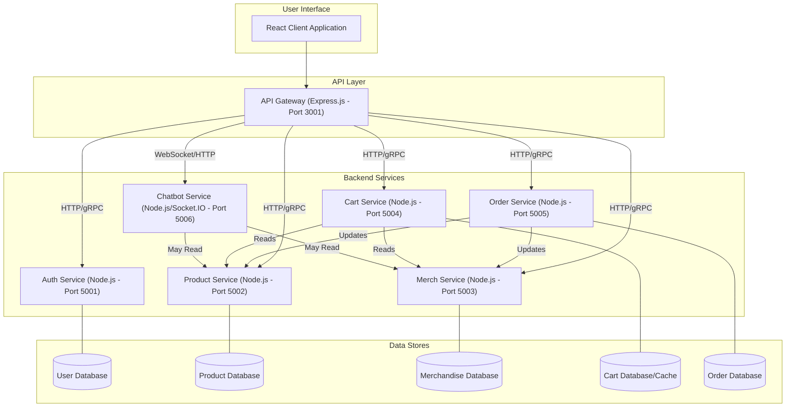

# OK BUT FIRST COFFEE (OKBF)


A modern e-commerce platform for a specialty coffee brand with an integrated merchandise store.

## Project Overview

OK BUT FIRST COFFEE is a full-stack e-commerce application built with React.js and Node.js microservices. The platform allows customers to browse and purchase premium coffee products and branded merchandise, while providing administrators with tools to manage products, inventory, and user accounts.

## Features

### Customer-Facing

- **Coffee Shop**: Browse and purchase premium coffee products
- **Merchandise Shop**: Shop for branded apparel and accessories
- **Coffee Club Subscription**: Subscribe to regular coffee deliveries
- **User Accounts**: Register, login, and manage profile
- **Shopping Cart**: Add products, update quantities, and checkout
- **Wishlist**: Save products for future purchase
- **Responsive Design**: Optimized for desktop and mobile devices

### Admin Dashboard

- **Product Management**: Add, edit, and delete coffee products
- **Merchandise Management**: Add, edit, and delete merchandise
- **Account Management**: View and manage user accounts
- **System Settings**: Configure application settings
- **Analytics**: View sales reports and site statistics

## Architecture

The application follows a microservices architecture:



**Key Components:**

- **React Client**: The single-page application that users interact with.
- **API Gateway**: The single entry point for all client requests. It routes requests to the appropriate backend microservice and handles cross-cutting concerns like authentication (via `AuthService`), rate limiting, and logging.
- **Auth Service**: Manages user authentication, registration, and token generation.
- **Product Service**: Manages the catalog of coffee products, including details, pricing, and inventory.
- **Merch Service**: Manages the catalog of non-coffee merchandise.
- **Cart Service**: Manages user shopping carts.
- **Order Service**: Handles order creation, processing, and history. It coordinates with Product and Merch services for inventory updates.
- **Chatbot Service**: Provides real-time chat functionality, potentially integrating with other services to answer queries.
- **Databases**: Each service (or a logical group of services) typically has its own database to ensure loose coupling.

**Communication:**

- The Client communicates with the API Gateway primarily via RESTful HTTP requests.
- The API Gateway communicates with backend services using a mix of RESTful HTTP and gRPC (for performance-critical internal communication).
- The Chatbot Service uses WebSockets (Socket.IO) for real-time communication with the client, proxied through the API Gateway.

## Tech Stack

### Frontend

- React.js
- React Router for navigation
- SCSS for styling
- Cloudinary React for image management
- Swiper for carousels
- ApexCharts for analytics visualization

### Backend

- Node.js with Express
- MongoDB with Mongoose
- API Gateway pattern
- Circuit breaker pattern for fault tolerance
- JWT authentication
- Memory cache for performance optimization
- gRPC and REST API communication between services

## Getting Started

### Prerequisites

- Node.js 18.x or later
- npm 9.x or later
- MongoDB

### Installation

1. Clone the repository:

```bash
git clone <repository-url>
cd coffee-shop
```

2. Install client dependencies:

```bash
cd client
npm install
```

3. Create client environment file:

```bash
# Create .env file in client directory
cp .env.example .env
# Edit the file with your configuration
```

4. Install server dependencies:

```bash
cd ../server
npm install
```

5. Set up each microservice:

```bash
# For each service (api-gateway, auth-service, product-service, merch-service)
cd [service-name]
npm install
cp .env.example .env
# Edit the .env file with your configuration
```

### Running the Application

#### Development Mode

1. Start the backend services:

```bash
# In separate terminals, navigate to each service directory
cd server/[service-name]
npm run dev
```

2. Start the client:

```bash
cd client
npm start
```

#### Production Mode

1. Build the client:

```bash
cd client
npm run build
```

2. Start the services:

```bash
# For each service
cd server/[service-name]
npm start
```

## Project Structure

```
coffee-shop/
├── client/                  # React frontend application
│   ├── public/              # Static files
│   ├── src/
│   │   ├── Api/             # API client functions
│   │   ├── Assets/          # Images, icons, etc.
│   │   ├── Components/      # Reusable UI components
│   │   ├── Context/         # React context providers
│   │   ├── Pages/           # Page components
│   │   ├── routes/          # Route definitions
│   │   └── utils/           # Utility functions
│   └── package.json
│
└── server/                  # Backend services
    ├── api-gateway/         # API Gateway service
    ├── auth-service/        # Authentication service
    ├── product-service/     # Product management service
    ├── merch-service/       # Merchandise management service
    └── README.md            # Server documentation
```

## License

This project is licensed under the MIT License - see the LICENSE file for details.
